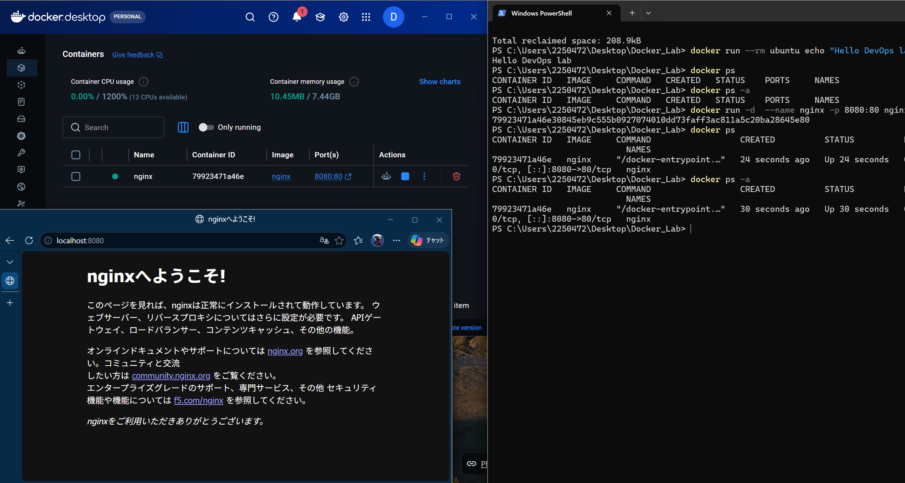

# 01 - Docker Basic Commands 🐳

My first hands-on Docker lab, covering the fundamentals of Docker images, containers, port mapping, container lifecycle, and basic container interaction.

## 🎯 What I Learned

- Docker images vs containers
- Interactive and detached containers
- Port mapping
- Container lifecycle management
- Container logs and shell access
- Temporary containers and cleanup

## Stracture

             Docker Image
                  │
                  ↓
             docker run
                  │
                  ↓
              Container
                  │
        ┌─────────┴─────────┐
        ↓                   ↓
    docker ps          docker logs
        │
        ↓
   docker exec
        │
        ↓
   Access Container
        │
        ↓
 stop / start / restart
        │
        ↓
     docker rm

## 🛠️ Commands Practiced

### Docker Basics

```bash
docker --version
docker info
docker pull hello-world
docker run hello-world
````

### Containers

```bash
docker run -it ubuntu bash
docker ps
docker ps -a
docker logs nginx
```

### Nginx & Port Mapping

```bash
docker run -d --name nginx -p 8080:80 nginx
```

Port mapping:

```text
localhost:8080 → nginx:80
```

Verify with:

```powershell
curl.exe http://localhost:8080
```

Result:

```text
PS C:\Users\2250472\Desktop\Docker_Lab> curl.exe http://localhost:8080
<!DOCTYPE html>
<html>
<head>
<title>Welcome to nginx!</title>
<style>
html { color-scheme: light dark; }
body { width: 35em; margin: 0 auto;
font-family: Tahoma, Verdana, Arial, sans-serif; }
</style>
</head>
<body>
<h1>Welcome to nginx!</h1>
<p>If you see this page, nginx is successfully installed and working.
Further configuration is required for the web server, reverse proxy,
API gateway, load balancer, content cache, or other features.</p>

<p>For online documentation and support please refer to
<a href="https://nginx.org/">nginx.org</a>.<br/>
To engage with the community please visit
<a href="https://community.nginx.org/">community.nginx.org</a>.<br/>
For enterprise grade support, professional services, additional
security features and capabilities please refer to
<a href="https://f5.com/nginx">f5.com/nginx</a>.</p>

<p><em>Thank you for using nginx.</em></p>
</body>
</html>
```

## 🔄 Container Lifecycle

```bash
docker stop nginx
docker start nginx
docker restart nginx
docker rm nginx
```

Access a running container:

```bash
docker exec -it nginx /bin/bash
```

Inside the container:

```bash
cat /etc/os-release
ls /usr/share/nginx/html
```

## 🧹 Cleanup

```bash
docker container prune
docker system prune
```

## 📸 Lab Evidence

### Nginx Container Running




## 📚 Key Takeaway

```text
Image
  ↓
docker run
  ↓
Container
  ↓
docker ps / logs / exec
  ↓
stop / start / restart
  ↓
remove
```

Successfully deployed and verified an **Nginx container using Docker**.

Author - Pyae Sone Phyo


